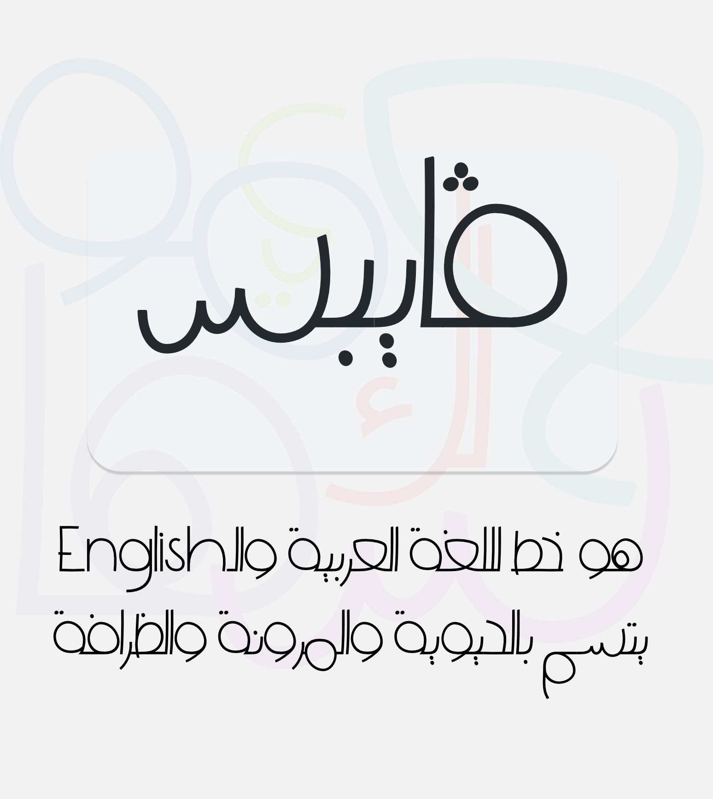

	

## Vibes Typeface

Vibes is a typeface designed for Arabic, as well as English languages. It was designed to be a mixture that radiates energy, flexibility, and cuteness.
It is specially designed to be used for title texts. Acknowledgements goes to Nadine Chahine, where this work wouldn't incepted without her help.

### [Download](https://raw.githubusercontent.com/bluemix/vibes-typeface/master/Vibes-Regular.ttf)

  
## Samples

This is my first-ever typeface designed from [Arabic Typogoraphy Course](http://arabictype.com/courses/course-spring-2019/).
It was designed to be used for titles.

